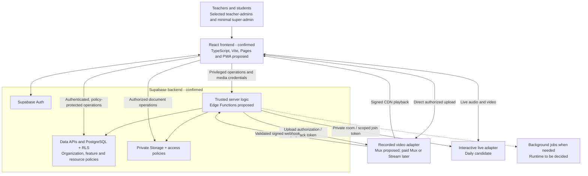

# MVP Architecture — Confirmed Stack and Recommendations

> Implementation update — 22 September 2026: the current UI and Supabase implementation, feature-based structure, and per-organization white labeling are now user-approved. See [implementation and deployment notes](implementation.md) for what is built, implementation choices, validation, and remaining hosted integration work. Earlier proposal language below is retained as product history.

Updated and provider sources checked: **22 September 2026**  
Status: **React frontend + Supabase backend confirmed for MVP and initial release**; finer libraries, hosting, video providers and runtimes remain recommendations. No implementation, purchase or deployment is authorized by this document.

The final user decision is React for the frontend and Supabase for the MVP and initial-release backend. Avoid Python in this phase. Supabase covers PostgreSQL, Auth, private storage and its APIs/functions as appropriate. Python may be considered later; there is no mandatory or scheduled migration.

Recommend one responsive React app with TypeScript, Vite and static Cloudflare Pages hosting, with optional PWA installation. Use Supabase APIs with enforced database/storage policies and propose Supabase Edge Functions for trusted application operations and provider integrations. Mux remains the recorded-video pilot recommendation and Daily the interactive live-class candidate. These finer choices are unapproved. Begin with a bounded pilot and add paid capacity as usage requires; production is not guaranteed to stay free. The earlier Hono/Cloudflare Workers standalone API proposal is superseded and is not a required additional MVP backend.

## Compact architecture

Arrows between server logic and video providers carry control requests, credentials and metadata. Media travels directly between the browser and provider; video upload, playback, encoding and live media must not pass through application functions. The app keeps lesson and session IDs independent from provider IDs. Private document storage is for materials/submissions, not raw lecture streaming. Direct browser access to Supabase APIs is permitted only where server-enforced policies fully cover the operation; interface controls are never the authorization boundary.

## Stack and boundaries

| Layer                          | Proposal                                                                                                  | Reason / constraint                                                                                                                      |
| ------------------------------ | --------------------------------------------------------------------------------------------------------- | ---------------------------------------------------------------------------------------------------------------------------------------- |
| User interface                 | React confirmed; TypeScript, Vite, Cloudflare Pages and optional PWA proposed                             | Shared teacher/student UI with gated administrative sections; no separate parent or teacher apps                                         |
| Backend APIs and trusted logic | Supabase backend confirmed; Data APIs/functions as appropriate, Edge Functions proposed for trusted logic | Organization/feature/role checks, video credentials, secrets and callbacks remain server-side; no additional standalone MVP API required |
| Identity and data              | Supabase Auth and PostgreSQL; RLS policy design proposed                                                  | Relational academic records and organization isolation; policies must be designed and tested                                             |
| Documents                      | Supabase Storage; private bucket design proposed                                                          | Scoped access to documents and submissions, with file/size quotas                                                                        |
| Recorded classes               | Mux adapter, signed playback                                                                              | Small free pilot; paid Mux or Cloudflare Stream are later options                                                                        |
| Interactive classes            | Google Meet (GMeet) adapter                                                                               | Meetings open directly in Google Meet for interactive teaching and simple attendee access                 |
| Search and review              | Curated catalog in PostgreSQL; teacher review before publication                                          | Filter by organization/access, grade/age and subject; no open-web search in the proposed MVP                                             |
| Operations                     | Audit records, usage ledger, provider reconciliation, background jobs as needed                           | Trace sensitive changes and control shared quotas; avoid premature service splitting                                                     |

Official implementation references, checked 22 September 2026: [Supabase Data APIs](https://supabase.com/docs/guides/api), [Supabase Edge Functions](https://supabase.com/docs/guides/functions), [Supabase function secrets](https://supabase.com/docs/guides/functions/secrets), [Supabase RLS](https://supabase.com/docs/guides/database/postgres/row-level-security), and [Vite on Pages](https://developers.cloudflare.com/pages/framework-guides/deploy-a-vite3-project/). React and Supabase are user-confirmed; these references inform the remaining implementation recommendations.

## Authorization and data flow

Trusted functions validate the authentication token and current organization membership, effective feature access, action permission and resource scope. Direct Data API operations must enforce equivalent applicable checks through RLS/database policies; they must not bypass feature or role checks implemented only in a function. Route sensitive mutations through trusted functions or carefully constrained database operations, and prevent alternate direct-write paths. Selected teachers receive explicit admin assignments; ordinary teachers receive none. Feature-change authority remains open. Supabase service-role access can bypass RLS: keep it server-only and explicitly authorize its limited operations. [Supabase RLS guidance](https://supabase.com/docs/guides/database/postgres/row-level-security).

Bind organization IDs to stored records and verify same-organization relationships. Do not trust an organization ID supplied by a browser. Keep private file policies aligned with membership and resource access. Never ship provider secrets or database administrative credentials to the client. Log access/configuration changes without logging playback tokens or student content. If a PWA is used, cache static assets only initially; offline student records and offline video are outside the proposal.

Recorded media: authorized teacher requests an upload → trusted Supabase function creates a provider upload authorization mapped to the organization's lesson → browser uploads directly → callback function validates provider signatures and deduplicates events → asset becomes ready for review → teacher approval publishes it. For playback, server logic rechecks entitlement/enrollment/publication before issuing a short-lived token. Mux documents server-generated JWTs for signed playback. Signed access is not a promise to prevent screen capture or an authorized viewer from copying what they can see. [Mux playback security](https://www.mux.com/docs/guides/secure-video-playback).

Live media: trusted Supabase functions create private rooms and issue short-lived, room-scoped meeting tokens after access and quota checks. Teacher host powers and student powers differ. Set room scope and expiry explicitly; enforce ejection/session end where required, since an expiring token alone must not be assumed to end a running call. Recording is optional and separately costed, with review before later publication. [Daily meeting tokens](https://docs.daily.co/reference/rest-api/meeting-tokens).

## Pilot costs and limits

Snapshot in USD, checked on 22 September 2026. These are provider allowances, not allowances automatically granted to each customer organization. Recheck terms before signup or launch.

| Service                                            | Verified free allowance / paid option                                                                                                                                                                                 | Planning implication                                                                                        |
| -------------------------------------------------- | --------------------------------------------------------------------------------------------------------------------------------------------------------------------------------------------------------------------- | ----------------------------------------------------------------------------------------------------------- |
| Mux recorded video                                 | Free: up to 10 stored on-demand videos and 100,000 delivery minutes/month; no card required; live excluded. [Pricing](https://www.mux.com/pricing)                                                                    | Suitable only for a tiny recording library; more stored videos require reconsidering the plan               |
| Daily interactive video                            | First 10,000 participant-minutes/month free; next tier $0.004/participant-minute. No automatic hard stop after free usage; recording is separately priced. [Pricing and FAQ](https://www.daily.co/pricing/video-sdk/) | Count every participant, including teachers; build usage/admission controls and separately budget recording |
| Cloudflare Stream, paid recorded-video alternative | $5/month per 1,000 minutes of storage capacity, purchased in increments; $1 per 1,000 delivered minutes. [Pricing](https://developers.cloudflare.com/stream/pricing/)                                                 | Paid migration candidate; not a free pilot recommendation                                                   |
| Supabase                                           | Free: 500 MB database, 1 GB file storage, 5 GB egress plus 5 GB cached egress; pauses after one week of inactivity; automatic backups not included. [Pricing](https://supabase.com/pricing)                           | Pilot tier; establish and test backups/restoration before using it as a school's system of record           |
| Cloudflare Pages, proposed static hosting          | Static asset requests that do not invoke Functions are free/unlimited. [Pages pricing](https://developers.cloudflare.com/pages/functions/pricing/)                                                                    | This recommendation covers the frontend; Workers API quotas are not the Supabase backend's limits           |

Example calculation, not a usage forecast: **(25 students + 1 teacher) × 60 minutes = 1,560 participant-minutes**. Six such sessions total **9,360**, leaving 640 of Daily's free allowance if there is no other usage. A seventh full session would exceed it. Concurrent sessions consume the same shared budget faster; meeting duration alone is not the billing unit.

Aim for near-zero provider spend only within a deliberately bounded pilot. Domain names, transactional email, extra storage, live recording, operational backups and optional services can introduce costs; no total operating-cost guarantee is made. Avoid enabling paid extras by default. Provider free quotas are shared across organizations using the same provider account/project, subject to that provider's scope—not multiplied by the number of SaaS customers.

## Cost controls and growth

Track global provider-account usage and per-organization attribution, including stored recording count/duration, delivered minutes, live participant-minutes, database/storage/egress and API usage. Reserve estimated live capacity before admitting a session, limit authorized duration/participants, reconcile provider usage, and leave headroom for delayed reporting, retries and concurrent sessions. Alerts alone are not a spend cap. Daily's lack of an automatic stop makes application admission and session-end controls necessary for a tightly bounded pilot; these need testing and cannot guarantee zero overrun.

Before exhausting a quota, decide whether to pause new uploads/sessions or fund an upgrade; do not silently create paid usage or delete educational records. Separate product subscription entitlements from operational provider budgets so a sold feature does not misleadingly appear available during a capacity block.

Keep adapters for video upload, processing status, playback credentials and session creation. Store provider name, asset/playback IDs and migration status alongside stable lesson IDs. Upgrade Mux in place when suitable, or migrate approved source media to Stream, verify captions/access/playback, switch lesson mappings and retain rollback until validated. Source-file retention/export availability and migration/duplicate-storage costs must be planned; an adapter does not make migration free or automatic.

Scale after measuring: index organization/course queries, paginate rosters, isolate expensive reports into jobs, raise Supabase database/API/function capacity and tune storage policies. Check function invocation/runtime limits separately from database and storage allowances; a Supabase backend is not unlimited compute. Supabase paid capacity is the initial growth path, not an automatic trigger to replace it. Split modules only when measured load or operational needs justify it. Before production, test backup restoration of both records and private files and validate tenant isolation and media-access revocation.

## Portability and optional future Python

Keep frontend data access behind clear application interfaces, preserve database migrations and explicit permission rules, and isolate video integrations behind adapters. This creates practical migration boundaries without adding another backend to the MVP.

Python may be introduced later if a concrete need justifies it, potentially alongside Supabase PostgreSQL, Auth and Storage. Adding a Python service is different from replacing all Supabase services. A full exit would also require plans for identities/sessions, file access/storage, Data APIs/functions, authorization, jobs and operations. Neither path is a zero-work switch: contracts, token validation, policies, tests, deployment and migration need deliberate work. No Python framework, adoption date or mandatory migration has been chosen.

## Decisions needed before sizing or implementation

- Active students and teachers initially, expected growth, and number of pilot organizations.
- Typical and maximum live-class size, session length, sessions per week, and simultaneous classes.
- Recording count, total duration, resolution, monthly viewing minutes, upload rate and retention period.
- Whether live sessions must be recorded, and which consent, review and access policies apply.
- Learner age/grade range, curriculum, languages, content reviewer and reporting responsibilities.
- Remaining library/hosting/video-provider choices, approved near-zero pilot limits, response to quota exhaustion, and future paid budget; React + Supabase is already confirmed.
- Invitation/recovery email delivery, private file volume, backup location/recovery targets and hosting/data-region constraints.

The long-term education suite—including digital school registers, documents/files/productivity/collaboration and inter-school connections—remains separate from this MVP. Organizations stay isolated by default; future sharing requires explicit scopes, grants and revocation. See the [screen plan](mvp-screens.md), [product specification](product-specification.md), and [decision log](decision-log.md).
